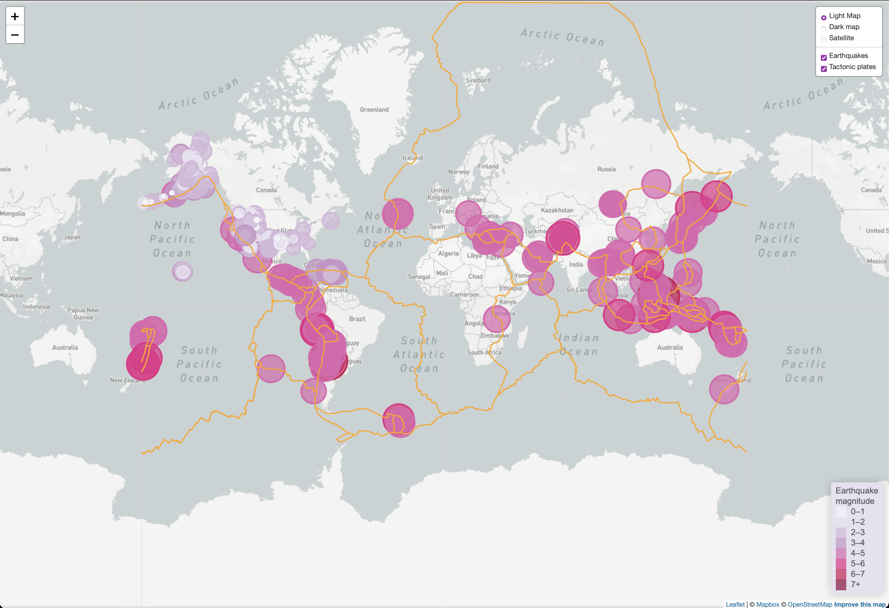
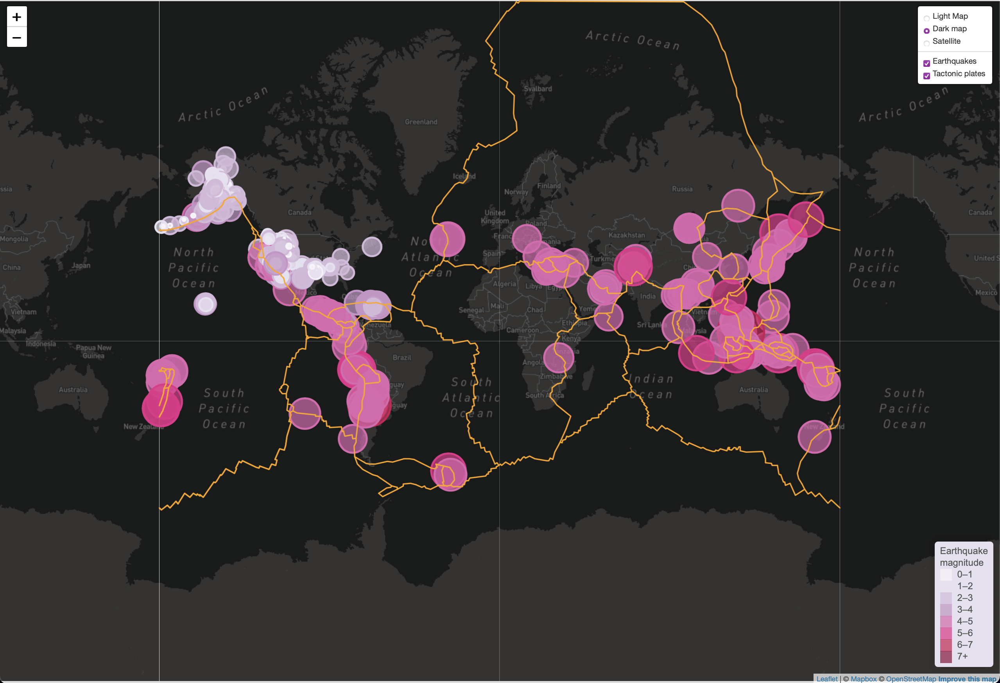
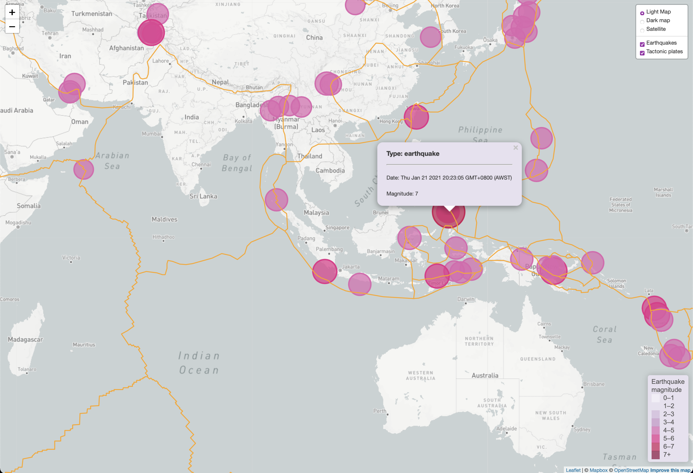

# leaflet-challenge
17 Leaflet - Visualising Data with Leaflet

Visualising an earthquake dataset with the circle diameter matching the magnitude of the earthquake. The pop-up provides the type, date and magnitude. 

